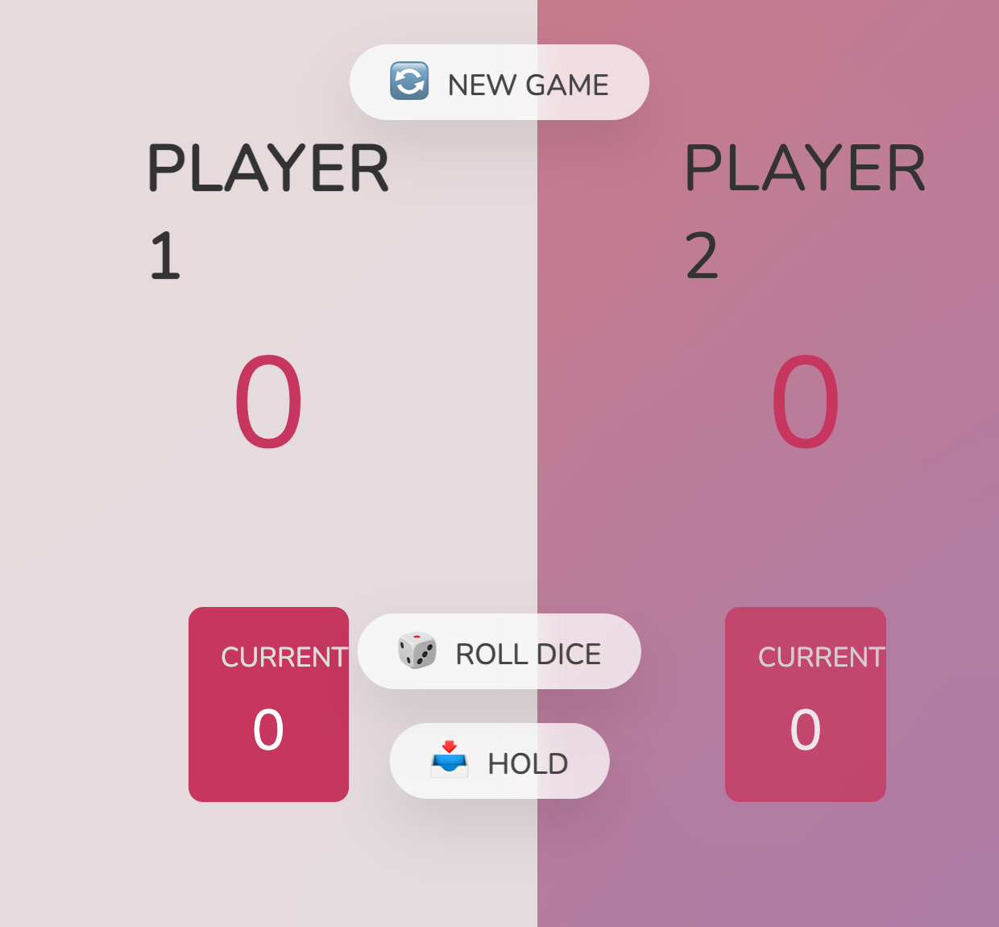

# Dice Game with Vite

A simple two-player dice rolling game implemented using Vite, HTML, CSS, and JavaScript.

## Features

- Two-player gameplay.
- Rolling the dice.
- Holding the current score.
- First player to reach a target score of 100 wins.

## Getting Started

1. Clone the repository.
2. Install dependencies with `npm install`.
3. Start the development server with `npm run dev`.
4. Open your web browser and navigate to `http://localhost:3000`.

## How to Play

- Players take turns rolling the dice.
- Click "Roll Dice" to roll and accumulate points.
- If a player rolls a 1, their current score resets.
- Click "Hold" to add current score to total.
- First to reach 100 wins.

## Build

To build the project for production, run `npm run build`. The optimized build will be available in the `dist` directory.

## License

This project is licensed under the [MIT License](LICENSE).
